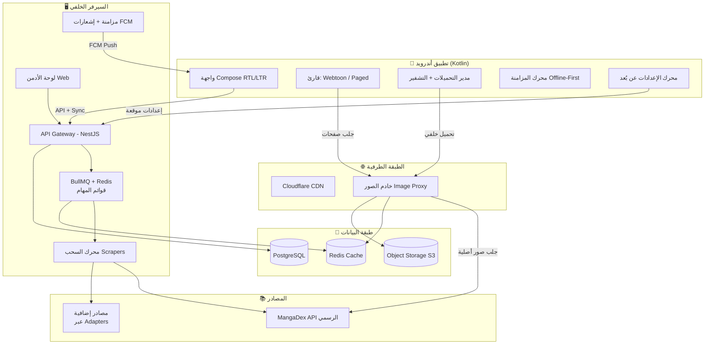

# MeloVerse — الخطة المعمارية والتقنية (Architecture Blueprint)

**الإصدار:** 1.0 | **الحالة:** مسودة اعتماد | **التقنية المعتمدة للتطبيق:** Kotlin أصلي (Native Android)

---

## 1. الملخص التنفيذي

MeloVerse منصة قراءة متكاملة للمانجا اليابانية، المانهوا الكورية، والمانها الصينية، مع قسم متابعة الأنمي والأخبار. الوثيقة تحدد البنية التقنية الكاملة للنظام المكوّن من خمس ركائز:

| الركيزة | الوصف |
|---|---|
| **تطبيق أندرويد** | Kotlin + Jetpack Compose، قارئ مزدوج (عمودي/أفقي) بدعم RTL/LTR، تحميلات مشفرة، مزامنة Offline-First |
| **السيرفر الخلفي** | Node.js (NestJS) + PostgreSQL + Redis، API متزامن للمكتبة والقراءة والتعليقات والإعدادات |
| **محرك السحب** | محرك محوّلات (Adapters) متصل بـ MangaDex API الرسمي كمصدر أول، مع جدولة وكوتا يومية وأوضاع جلب متعددة |
| **خادم الصور** | وسيط (Proxy) يضغط الصور (WebP/AVIF) ويخزنها مؤقتًا لتقليل استهلاك البيانات وحماية السيرفر |
| **لوحة الأدمن + بناء APK** | لوحة ويب تتحكم بالسحب والإعلانات والصلاحيات، ونظام يبني APK موقّعًا بضغطة زر |

**المبادئ المعمارية الحاكمة:**
1. **Offline-First:** قاعدة بيانات محلية (Room) هي مصدر الحقيقة داخل الجهاز، والسيرفر للتزامن والدفع فقط.
2. **Config-Driven:** الإعلانات والحدود والميزات تُدار عن بُعد عبر إعدادات JSON موقّعة — بدون إعادة رفع التطبيق.
3. **قابلية الإضافة:** كل مصدر محتوى هو Adapter قابل للتركيب/الإزالة دون تغيير باقي النظام.
4. **حماية المحتوى بلا تضحية بالأداء:** تشفير محلي بمفاتيح Keystore + ضغط الصور في الطرف الخادم.

---

## 2. نظرة عامة على البنية (System Overview)



**تدفق البيانات الأساسي:** التطبيق يقرأ دائمًا من الـ Room أولًا (فوري)، ويسحب من السيرفر عند الحاجة (تحديث الفصول، المزامنة، الإعدادات)، والصور تمر عبر خادم وسيط يضغطها ويخزنها مؤقتًا قبل الوصول للمستخدم — بينما محرك السحب يملأ قاعدة بيانات السيرفر من المصادر بشكل دوري أو يدوي من اللوحة.

---

## 3. حزمة التقنيات (Tech Stack)

### 3.1 تطبيق أندرويد (Kotlin أصلي)

| المكوّن | الاختيار | المبرر |
|---|---|---|
| اللغة | **Kotlin 2.x** | رسمية لأندرويد، Coroutines/Flow، توافق كامل مع Compose |
| الواجهة | **Jetpack Compose** (Material 3) | دعم RTL/LTR تلقائي عبر `LayoutDirection`، أداء عالٍ مع قوائم طويلة (`LazyColumn`) |
| العمارة | **Clean Architecture + MVVM** | فصل domain/data/presentation وقابلية الاختبار |
| حقن التبعية | **Hilt (Dagger)** | قياسي وموثوق |
| قاعدة بيانات محلية | **Room** | مصدر الحقيقة Offline-First، دعم Relations وMigration |
| الشبكة | **Retrofit + OkHttp** | Interceptors للتشفير/التوقيع، دعم HTTP/2 والتنزيلات المتقطعة |
| تحميل الصور | **Coil** | قائم على Kotlin/Coroutines، أفضل أداء مع Compose، ذاكرة تخزين مؤقت طبقتين |
| مهام الخلفية | **WorkManager** (2.11+) | تحميلات موثوقة مع Constraints (شبكة/شحن) |
| التخزين الآمن | **Android Keystore + EncryptedSharedPreferences** | مفاتيح AES-256-GCM بأمان الجهاز |
| الإشعارات | **FCM** + قنوات إشعارات مخصصة | تنبيهات الفصول الجديدة |
| المزامنة | **DataStore (Preferences/Proto)** + محرك Sync مخصص | حالات محلية خفيفة + مزامنة دلتا |

### 3.2 السيرفر الخلفي

| المكوّن | الاختيار | المبرر |
|---|---|---|
| الإطار | **Node.js + NestJS (TypeScript)** | TypeScript مشترك مع اللوحة، وحدة `@nestjs/bullmq` جاهزة للصفوف |
| قاعدة البيانات | **PostgreSQL 16** | بيانات علائقية (مستخدم/عمل/فصل) مع Full-Text Search وJSONB |
| قوائم المهام | **BullMQ + Redis** | جدولة، Retry، أولويات، مراقبة فورية عبر UI |
| التخزين الكائنات | **S3-compatible** (MinIO للاختبار / R2 أو S3 للإنتاج) | صور مؤقتة + ملفات APK + نسخ احتياطية |
| خادم الصور | **خدمة مستقلة خفيفة (Node + sharp/libvips)** | ضغط WebP/AVIF فائق السرعة، عزل الحمولة عن API |
| CDN | **Cloudflare** | تخزين مؤقت عالمي + حماية من الهجمات |
| الوكساء | Docker Compose (تطوير) / VPS + Docker (إنتاج) | نشر مبسط وقابل للنقل |

### 3.3 لوحة الأدمن

**React + TypeScript + Vite** (SPA تخدم من NestJS كـ Static Assets) — أو بديل أبسط: **React + shadcn/ui**. تتصل بالـ API عبر WebSocket (مراقبة حية للمهام) وREST.

---

## 4. بنية تطبيق أندرويد (Android App)

### 4.1 هيكل الوحدات (Modular Monolith)

```
meloverse-android/
├── app/                          # نقطة الدخول + Hilt + Navigation
├── core/
│   ├── design-system/            # الثيم، RTL، المكونات المشتركة
│   ├── network/                  # Retrofit، Interceptors، JWT
│   ├── database/                 # Room: الكيانات + DAOs + Migration
│   ├── datastore/                # الإعدادات المحلية والإعدادات البعيدة المخزنة
│   ├── sync/                     # محرك المزامنة (WorkManager + API)
│   ├── download/                 # مدير التحميلات + الحاوية المشفرة
│   ├── security/                 # Keystore، التشفير/فك التشفير
│   └── common/                   # أدوات، Extensions، Logging
├── feature/
│   ├── home/                     # الرئيسية + الاستمرار في القراءة + الجديد
│   ├── browse/                   # البحث + التصنيفات + المصادر
│   ├── manga-detail/             # صفحة العمل: الفصول، التفضيل، المشاركة
│   ├── reader/                   # القارئ (قلب التطبيق)
│   ├── comments/                 # التعليقات والتفاعلات
│   ├── library/                  # المكتبة: المفضلة + السجل + المحفوظات
│   ├── downloads/                # إدارة التحميلات
│   ├── profile/                  # الحساب، VIP، الإعدادات
│   └── news/                     # أخبار/جدول الأنمي
```

**قاعدة ذهبية:** `feature/*` لا ترى بعضها، وتتواصل فقط عبر `core/*` — لتسريع البناء (Gradle كاش) والحفاظ على عزل الميزات.

### 4.2 محرك القارئ (Reader Engine) — القلب

**أوضاع العرض (قابلة للتغيير من القارئ مباشرة):**

| الوضع | التقنية | التفاصيل |
|---|---|---|
| **Webtoon (عمودي)** | `LazyColumn` + صفحات بارتفاعات فعلية | تمرير لا نهائي بين الفصول (انظر أدناه) |
| **Paged (أفقي)** | Pager بـ `LayoutDirection` | انزلاق LTR للمانجا/المانهوا، RTL للعربية |
| **عرض مزدوج** | Pager مع صفحتين | للأجهزة اللوحية |

**مكونات الأداء الأساسية:**
- **Coil** مع `ImageLoader` مخصص: ذاكرة (Memory) + قرص (Disk) + سياسة `DataSaver` (جودة `data-saver` من MangaDex) للمستخدمين ذوي البيانات المحدودة.
- **Prefetch:** تحميل N صفحة تالية (10 افتراضيًا) عبر `LazyColumn` `beyondViewportItemCount`.
- **Infinite Scroll:** عند الوصول إلى آخر صفحة من الفصل الحالي:
  1. جلب بيانات الفصل التالي (من الـ Room أو السيرفر إن لم يوجد).
  2. إلحاق صفحاته بقائمة الجلسة (Webtoon) أو الانتقال التلقائي (Paged).
  3. حفظ تقدم القراءة عند كل انتقال.
- **تتبع التقدم:** موضع `firstVisibleItemIndex` يُسجل كل 3 ثوانٍ + عند التوقف — عبر محرك المزامنة.

**التحكم في الاتجاه (RTL/LTR):**
- `Locale` التطبيق (ar / en) يحدد `LayoutDirection` العام تلقائيًا في Compose.
- اتجاه الفصل نفسه يُحترم: عمل عربي يُقرأ RTL حتى لو كانت واجهة المستخدم إنجليزية والعكس — عبر خاصية `readingDirection` في بيانات العمل.
- السلاسل النصية في `values/` و `values-ar/` مع تعريب كامل (واجهة + تواريخ + أرقام فصول).

### 4.3 التفاعل والمجتمع (على مستوى الصفحة)

- **Reactions على صفحة محددة:** كل صفحة لها معرف (`chapterId:pageIndex`). التفاعلات تُرسل عبر طابور محلي (Room) وتُرفع عند توفر الشبكة (يدعم العمل دون اتصال).
- **التعليقات:** مرتبطة بالفصل ككل، مع تفاعلات إعجاب، ومشرفات تلقائية (كلمات محظورة) + رفع تقارير.

### 4.4 نظام التحميلات المتقدم (Download Queue & Offline)

**مدير التحميلات** — حالة آلية كاملة (Room + WorkManager):

```
QUEUED → RUNNING → PAUSED ⇄ RUNNING → COMPLETED
                          ↘ FAILED → (Retry with backoff)
```

| الميزة | التنفيذ |
|---|---|
| إيقاف/استئناف/أولوية | جدول `download_tasks` مع `priority` وقابلية إيقاف عبر إلغاء Worker والاحتفاظ بالحالة |
| Constraints | شبكة WiFi فقط (اختياري)، شحن البطارية (اختياري)، مساحة كافية |
| **التحميل التنبؤي** | عند اكتمال فصل، يُضاف الفصل التالي تلقائيًا كأولوية منخفضة — يوضع في طابور `PREFETCH` لا يحسب ضمن كوتا المستخدم |
| تعدد التزامن | Worker متزامن 2–3 تنزيلات بالتوازي مع أولوية الأعلى أولًا |

**التشفير والضغط — صيغة الحاوية المحلية `.melo`:**
- الحاوية = **Header** (Magic `MELO`, version, cipher params, عدد الصفحات) + **Manifest مشفر** (أسماء الملفات والترتيب) + **صفحات مشفرة**.
- التشفير: **AES-256-GCM** بمفتاح تولده التطبيق مرة واحدة ويُخزن في **Android Keystore** (hardware-backed حيثما توفر)، مع `nonce` فريد لكل ملف.
- لا يُكتب المفتاح أبدًا على القرص بنص واضح، ولا يُرسل للسيرفر — الفصل المشفر عديم الفائدة خارج الجهاز.
- الضغط: الصور تُحوَّل إلى WebP (جودة 82) عند التنزيل إن أمكن (تقليل ~40-60%)، مع خيار "الجودة الأصلية" للـ VIP.

### 4.5 المزامنة والإشعارات (Sync & Notifications)

**Offline-First Sync:**
1. كل التغييرات المحلية (تقدم قراءة، مفضلة، إشارات، تفاعلات) تُكتب في Room + جدول `outbox`.
2. Worker دوري (مع `NetworkType.CONNECTED`) يرفع الدلتا ويجلب دلتا السيرفر (`GET /sync/delta?since=<cursor>`).
3. التعارضات: قاعدة **آخر تعديل يفوز** لكل حقل، مع الحفاظ على الفصل الأحدث في القراءة.
4. الدمج: سجل القراءة يُدمج بدلًا من الاستبدال.

**الإشعارات الفورية للفصول الجديدة:**
- المستخدم يفضّل عملًا → السيرفر يسجل في جدول `follows`.
- محرك السحب يكتشف فصلًا جديدًا → مهمة إشعارات ترسل FCM عبر **موضوع (Topic)** لكل عمل (تجنب إرسال فردي لكل مستخدم).
- التطبيق يعرض الإشعار ويحدّث المكتبة تلقائيًا عند فتحه.

---

## 5. قاعدة البيانات (PostgreSQL)

```mermaid
erDiagram
    USERS ||--o{ FOLLOWS : has
    USERS ||--o{ READING_HISTORY : has
    USERS ||--o{ BOOKMARKS : has
    USERS ||--o{ COMMENTS : writes
    USERS ||--o{ DEVICES : owns
    MANGA ||--o{ CHAPTERS : contains
    CHAPTERS ||--o{ PAGES : contains
    MANGA ||--o{ FOLLOWS : followed_by
    CHAPTERS ||--o{ COMMENTS : has
    MANGA ||--o{ REACTIONS : receives
    SOURCES ||--o{ SOURCE_JOBS : runs
    USERS ||--o{ DOWNLOAD_LIMITS : consumes

    USERS { uuid id; text username; text email; text pass_hash; text role; timestamptz created_at }
    DEVICES { uuid id; uuid user_id; text fcm_token; text platform; timestamptz last_seen }
    MANGA { uuid id; text title_ar; text title_en; text slug; text cover_path; text status; text content_type; int follower_count; timestamptz updated_at }
    CHAPTERS { uuid id; uuid manga_id; int number; text title; text language; text source_id; text source_chapter_id; int page_count; timestamptz published_at }
    PAGES { uuid id; uuid chapter_id; int index; text url; int width; int height }
    FOLLOWS { uuid id; uuid user_id; uuid manga_id; timestamptz created_at }
    READING_HISTORY { uuid id; uuid user_id; uuid chapter_id; int page_index; float progress; timestamptz updated_at }
    BOOKMARKS { uuid id; uuid user_id; uuid chapter_id; int page_index; text note; timestamptz created_at }
    COMMENTS { uuid id; uuid chapter_id; uuid user_id; text body; int likes; uuid parent_id; timestamptz created_at }
    REACTIONS { uuid id; uuid user_id; uuid chapter_id; int page_index; text type; timestamptz created_at }
    SOURCES { uuid id; text name; text adapter; jsonb config; boolean enabled; int daily_quota; timestamptz last_run }
    SOURCE_JOBS { uuid id; uuid source_id; text mode; jsonb params; text status; int progress; text error; timestamptz created_at }
    DOWNLOAD_LIMITS { uuid id; uuid user_id; date day; int count }
    AD_CONFIGS { uuid id; text key; jsonb value; int version; boolean active; timestamptz updated_at }
    APP_BUILDS { uuid id; text tag; text status; text apk_url; int version_code; timestamptz created_at }
```

**ملاحظات تصميمية:**
- `MANGA.title_ar / title_en` + `content_type` (manga/manhwa/manhua) لدعم التصنيف والبحث ثنائي اللغة.
- فهرس فريد `(source_id, source_chapter_id)` في `CHAPTERS` لمنع التكرار عند السحب المتكرر.
- `REACTIONS` فهرس فريد `(user_id, chapter_id, page_index, type)` — تفاعل واحد لكل نوع لكل صفحة.
- `AD_CONFIGS` بنسخة (version) — التطبيق يطلب أحدث نسخة ويخزنها محليًا لتطبيق فوري.

---

## 6. محرك السحب المخصص (Custom Scraper Engine)

### 6.1 واجهة المحوّل (Source Adapter)

كل مصدر ينفّذ واجهة موحدة — إضافة مصدر = إضافة ملف واحد:

```typescript
interface SourceAdapter {
  id: string;
  name: string;
  async search(query: string, page: number): Promise<MangaResult[]>;
  async getManga(id: string): Promise<MangaDetail>;
  async getChapters(mangaId: string, opts?: ChapterOpts): Promise<Chapter[]>;
  async getLatestUpdates(page: number): Promise<MangaResult[]>;
  async getPageUrls(chapter: ChapterRef): Promise<string[]>;
}
```

### 6.2 محوّل MangaDex (المصدر الأول — API رسمي)

يستخدم **MangaDex API v5** (https://api.mangadex.org) بالكامل:

| الغرض | النقطة |
|---|---|
| البحث والتصفح | `GET /manga?title=..&includedTags=..&contentRating[]=safe&availableTranslatedLanguage[]=ar` |
| تفاصيل العمل | `GET /manga/{id}?includes[]=cover_art,author,artist` |
| قائمة الفصول | `GET /manga/{id}/feed?translatedLanguage[]=ar&order[publishAt]=desc` |
| صور الفصل | `GET /at-home/server/{chapterId}` ← `baseUrl` + `hash` + `data[]` / `dataSaver[]` |

**قواعد إلزامية من وثائق MangaDex (لتجنب الحظر):**
1. **لا تُخزَّن روابط `baseUrl`:** صلاحيتها 15 دقيقة — أعد استدعاء `/at-home/server` عند الحصول على 403.
2. **لا تمرر رؤوس مصادقة** عند جلب الصور من خوادمهم (سيُرفض الطلب).
3. **إبلاغ عن صحة العقد:** `POST https://api.mangadex.network/report` لكل صورة مأخوذة من عقدة MangaDex@Home (نجاح/فشل + حجم + مدة) — واجب بروتوكولي.
4. `User-Agent` ثابت يصف التطبيق (مثال: `MeloVerse/1.0 (android)`).
5. Throttling مهذب (المسار الافتراضي: 5 req/s) + Retry مع Backoff.

### 6.3 الجدولة والكوتا اليومية

- **جدولة:** BullMQ `Repeatable Jobs` (cron) — افتراضيًا تشغيل السحب كل 6 ساعات + "سحب الجديد" يوميًا.
- **الكوتا اليومية:** `SOURCES.daily_quota` (افتراضي **100 عمل جديد يوميًا**) — عدّاد يومي في Redis (`INCR` + `EXPIRE`) يحسب على مستوى المصدر، قابل للتعديل من اللوحة.
- **أوضاع جلب الفصول:** `full` (كل الفصول) / `last:N` (آخر N فصل) / `range:from-to` (نطاق محدد) — تُمرر عبر `ChapterOpts`.
- **السحب الشامل (Bulk Pull):** زر واحد → يُنشئ مهمة لكل مصدر `getLatestUpdates` مع تصفية ما هو موجود (`source_chapter_id` فريد) ووضع الجديد في صفوف المهام.
- **حالات المهمة:** `queued → running → completed | failed` مع تقدم (٪) يُبث للوحة عبر WebSocket — مع أزرار **إيقاف/إعادة/حذف** لكل مهمة.
- **الدمج عبر المصادر (اختياري):** مطابقة العناوين الموحدة (Normalized title hash) لربط نفس العمل من مصادر متعددة في سجل واحد — يُفعَّل لاحقًا، ولا يحجب المرحلة الأولى.

---

## 7. خادم الصور (Image CDN & Proxy)

### 7.1 التدفق

```
التطبيق ──GET /img/{source}/{chapterId}/{page}?q=82&mode=data-saver──► Proxy
Proxy: 1) تحقق من Object Storage/Redis (HIT?) 2) إن لم يوجد: استدعاء /at-home/server
       3) جلب الصورة الأصلية (بدون auth headers) 4) ضغط إلى WebP/AVIF
       5) تخزين في S3 + Redis 6) إرجاع مع Cache-Control طويل
```

### 7.2 المزايا

| الميزة | التنفيذ |
|---|---|
| **ضغط تلقائي** | sharp/libvips: تحويل WebP (q=75-85) أو AVIF (q=60) + تغيير الحجم حسب `w` — تقليل 50-70% من حجم الصورة |
| **تخزين مؤقت** | Redis (ساخن، TTL 24h) + S3 (بارد، TTL 7-30 يوم)؛ `Cache-Control: public, max-age` |
| **حماية السيرفر** | Rate limiting لكل IP/مستخدم + توقيع روابط (Signed URL مع `exp`) + منع Referer خارجي (Hotlink protection) |
| **استقرار العقد** | لا يُخزن `baseUrl`؛ إعادة استدعاء `/at-home/server` عند 403 + إبلاغ `mangadex.network/report` |
| **وضع التوفير** | `mode=data-saver` يوجه للجودة المضغوطة من المصدر أصلًا — خطوة إضافية للتوفير |
| **مسارات مباشرة (اختياري)** | خيار في الإعدادات: التطبيق يجلب من `uploads.mangadex.org` مباشرةً لتخفيف الضغط عن الخادم — يُفعَّل/يُعطَّل عن بُعد من الإعدادات الموقعة |

### 7.3 البنية

- خدمة مستقلة (منفصلة عن API) بنفس الصورة الحاوية — قابلة للتوسع الأفقي، خلف Cloudflare.
- مفتاح كاش `sha256(source:chapter:page:quality:width)`.
- **Vary**: استجابة JSON/HTML لا تُخزن؛ فقط الصور.

---

## 8. لوحة التحكم المركزية (Admin Control Panel)

### 8.1 الأقسام

| القسم | الوظائف |
|---|---|
| **لوحة القيادة** | إحصائيات حية: مستخدمون، قراءات، تحميلات، حالات المهام، أداء المصادر (مخططات) |
| **محرك السحب** | تفعيل/تعطيل المصادر، كوتا يومية، أوضاع الجلب، **زر السحب الشامل**، مراقبة قائمة المهام (تقدم/إيقاف/إعادة) عبر WebSocket |
| **المحتوى** | بحث وتعديل الأعمال والفصول، رفع الغلاف، حذف مكرر، تعديل عناوين ثنائية اللغة، مراجعة التقارير والتعليقات |
| **الإعلانات** | تمكين الأنواع (Banner / Interstitial / Rewarded)، التردد (كل N فصل)، المواضع داخل القارئ، تخصيص لكل خطة — يُحفظ كـ `AD_CONFIGS` (إصدار + توقيع) ويُطبَّق فورًا **بدون رفع تطبيق جديد** |
| **الوصول والخطط** | حدود تحميل يومية للمجاني (مثال: 20 فصل/يوم)، فتح كامل للـ VIP، مفاتيح AdMob/وسيطات، قائمة إيقاف الأجهزة |
| **المستخدمون** | بحث، ترقية VIP، حظر، سجل النشاط |
| **البناء والتصدير** | صفحة بناء APK (القسم 9) |
| **الإعدادات العامة** | إعدادات المزامنة، الإشعارات، الخصوصية، نسخ احتياطي/استعادة |

### 8.2 الإعدادات الموقعة عن بُعد (Config-Driven)

```
GET /api/v1/config?appVersion=2.1.0
→ { "version": 42, "payload": {...ads, limits, flags...}, "signature": "base64..." }
```
- التطبيق يتحقق من التوقيع (مفتاح عام مضمّن في APK) قبل التطبيق.
- يعمل وضع **Kill-switch** للميزات (مثلًا: إيقاف التحميلات المجانية فورًا).
- يمنع العبث بالعميل (مع ذلك، لا يُعد حماية أمنية كاملة — أي عميل قابل للاختراق).

---

## 9. بيئة البناء والتصدير التلقائي (Automated APK Builder)

### 9.1 البنية

```
[لوحة الأدمن] --POST /api/admin/builds {branch, versionCode, releaseNotes}-->
[API] --> BullMQ job --> [Build Worker: Docker + Android SDK]
                              │
                              ├─ git checkout (المشروع المصدري للتطبيق)
                              ├─ ضبط versionCode/versionName و baseUrl
                              ├─ gradle assembleRelease
                              ├─ توقيع بـ keystore (من Vault/Secrets)
                              └─ رفع APK إلى Object Storage
                                   │
                                   ▼
                      [التطبيق]: فحص تحديثات OTA (versionCode > محلي)
```

### 9.2 التفاصيل

| الجانب | الحل |
|---|---|
| بيئة البناء | حاوية Docker مع Android SDK + JDK + Gradle مُسبق التحميل (صورة جاهزة) |
| التوقيع | keystore محفوظ في مخزن أسرار (Vault/Env مشفر) — لا يلمس المطورون أبدًا |
| **الإعدادات لكل بناء** | ملف `build-config.json` يُحقن في البناء (baseURL، معرف المصدر، مفاتيح إعلانات، شعار، اسم الحزمة) — **بناءات بيضاء (White-label) متعددة من نفس الكود** |
| الإصدارات | `versionCode` تلقائي متزايد + سجل بناءات في `APP_BUILDS` |
| **OTA** | نقطة `GET /api/v1/update/latest` → التطبيق يقارن `versionCode` ويعرض تنزيل APK مع التحقق من التجزئة (SHA-256) |
| المراقبة | بث سجل البناء (log streaming) إلى اللوحة عبر WebSocket + إشعار نجاح/فشل |
| بديل | GitHub Actions بنفس الـ workflow — الاختيار قابل للتبديل |

---

## 10. الأمان والامتثال

| المجال | الإجراءات |
|---|---|
| المصادقة | JWT (Access 15m + Refresh 30d بتدوير)، bcrypt/argon2 لكلمات المرور، حماية Brute-force |
| API | Rate limiting لكل مستخدم/IP، CORS مقيد، TLS إلزامي |
| المحتوى المحلي | تشفير AES-256-GCM بمفاتيح Keystore؛ الصور تُحفظ داخل الحاوية المشفرة |
| لوحة الأدمن | 2FA إلزامية + جلسات محدودة + سجل تدقيق (Audit log) |
| الإعدادات البعيدة | توقيع ECDSA وتحققه التطبيق قبل التطبيق |
| الخصوصية | FCM موضوعية (لا حاجة لتخزين محتوى الرسائل)، سياسة حذف حساب كاملة |
| **الامتثال القانوني** | المصدر الأول (MangaDex) **API رسمي عام** — مسار قانوني. أي مصدر إضافي يجب التحقق من شروط الخدمة وحقوق النشر قبل الربط؛ طبقة الـ Adapters مصممة بحيث يُضاف/يُحذف المصدر دون كسر النظام. الإشعار داخل التطبيق بأن المحتوى حقوق ملكية لناشريه. |

---

## 11. خارطة طريق التنفيذ المقترحة

| المرحلة | المحتوى | المدة التقديرية |
|---|---|---|
| **P0 — الأساس** | سيرفر API (مصادقة + أعمال + فصول)، محوّل MangaDex، تطبيق: تصفح/بحث/تفاصيل، قارئ Webtoon+Paged، مكتبة ومفضلة، تتبع قراءة محلي | 6–8 أسابيع |
| **P1 — القارئ المتقدم** | Infinite scroll، مزامنة Offline-First كاملة، تحميلات + تشفير، تفاعلات/تعليقات، FCM للفصول الجديدة | 4–6 أسابيع |
| **P2 — لوحة الأدمن** | محرك السحب الكامل (كوتا/أوضاع/سحب شامل/مراقبة)، إعدادات الإعلانات والوصول عن بُعد، إدارة المستخدمين | 4–5 أسابيع |
| **P3 — الصور والبناء** | خادم الصور (ضغط + كاش + توقيع روابط)، نظام بناء APK + OTA | 3–4 أسابيع |
| **P4 — التجهيز للإطلاق** | اختبار شامل، تحسين أداء، تحليلات، إصدار تجريبي ثم عام | 2–3 أسابيع |

**ملاحظة على الجدولة:** تسمح العمارة المعيارية بتنفيذ P1 بالتوازي مع P2 لفريقين منفصلين.

---

## 12. القرارات المفتوحة (Open Decisions)

1. **مصادر إضافية بجانب MangaDex:** ما المصادر المستهدفة (مانهوا/مانها خاصة)؟ — تؤثر على Adapters وتكاليف السحب. *يُوصى بالبدء بـ MangaDex فقط ثم الإضافة.*
2. **الأنمي:** هل "متابعة الأنمي" تعني أخبار/جدول حلقات فقط (AniList API العام كافٍ) أم بث فيديو (يتطلب تراخيص وبنية مختلفة كليًا)؟ *يُفترض الخيار الأول حتى إشعار آخر.*
3. **حجم المستخدمين المتوقع:** يحدد سعة الخوادم وتصميم التوسع (يُفترض البدء: 10-50K مستخدم، سيرفر واحد + توسع أفقي لاحق).
4. **مخزون الإعلانات:** AdMob فقط أم وساطة (Mediation) متعددة؟ يحدد صفحة إعدادات الإعلانات.
5. **التوزيع:** APK مباشر فقط أم أيضًا نشر على متجر (يتطلب مراجعة سياسات المحتوى)؟

---

*الوثيقة جاهزة للاعتماد؛ بعد الموافقة على القرارات المفتوحة يمكن البدء مباشرة بمرحلة P0 وتوليد هيكل المشروع الفعلي.*
